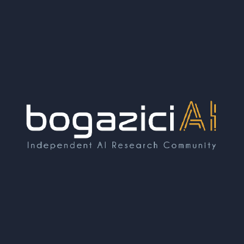

# bogaziciAI 

bogaziciAI is a non-profit community that focuses on recruiting new researchers in the area, developing AI projects, and assisting on-going projects.

Our aim is to create a culture that guides people who are interested in the field, but do not know where to start or what to learn. By doing so, we believe that, in a short period, a sufficient number of researchers will be continuously solving advanced challenges in the development of AI technology.

As we focus on both recruiting new researchers and conducting advanced research, we designed a mentor-mentee system, in which every member of the community is responsible to guide their mentee while working on the desired tasks given by their mentor. With this structure, we believe that sincere relationships and disciplined learning environment are achieved. We try to eliminate the lack of motivation in "communşty classes" by maintaining social interaction and attention.
